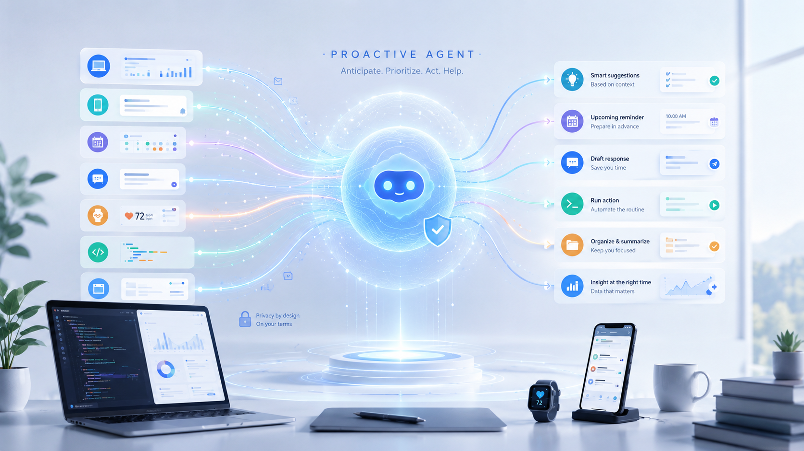

<p align="center">
  
</p>

<h1 align="center">Awesome Proactive Agents</h1>

<p align="center">
  
</p>

<p align="center">
  <a href="https://awesome.re"></a>
  <a href="https://github.com/LowEntropyAI/Proactive-Agent-Project/pulls"></a>
  
  
</p>

> A curated list of papers, benchmarks, project pages, and code for **proactive agents**: AI systems that infer latent user needs, decide when to intervene, ask for missing context or consent, and initiate useful assistance before an explicit command.

---

## Contents

- [Scope](#scope)
- [Must Read](#must-read)
- [Papers](#papers)
  - [Foundations, Surveys and Human Factors](#foundations-surveys-and-human-factors)
  - [Proactive Interaction and Planning](#proactive-interaction-and-planning)
  - [GUI, Mobile, OS and Coding Agents](#gui-mobile-os-and-coding-agents)
  - [Multimodal, Wearable and Embodied Agents](#multimodal-wearable-and-embodied-agents)
  - [Benchmarks, Personalization and Optimization](#benchmarks-personalization-and-optimization)
- [Benchmarks](#benchmarks)
- [Contributing](#contributing)

---

## Scope

This list prioritizes papers where **proactivity is a central research target**. The list is broader than computer-use agents: it includes proactive dialogue, planning, recommendation, wearable assistance, GUI/mobile/OS agents, programming assistants, personalization, benchmarks, and human factors.

Typical inclusion signals:

- The agent predicts latent intent or missing context before a complete user instruction.
- The agent decides when to ask, suggest, remind, intervene, execute, or stay silent.
- The paper evaluates proactive behavior, intervention timing, user control, consent, or interruption cost.
- The benchmark or dataset makes proactivity the primary task rather than a side effect of general tool use.

Resource labels:

- **Paper**: arXiv, ACL Anthology, DOI, OpenReview, ACM, Springer, or official proceedings page.
- **Page**: project page, conference page, Google Research page, Hugging Face paper page, or documentation.
- **Code**: GitHub, released code, released benchmark, or released dataset.
- **Notes**: local summary in this repository.

---

## Must Read

Selected starting points for understanding the field.

| Date | Paper | Why read it first | Resources |
|---|---|---|---|
| 2024-04 | **Towards Human-centered Proactive Conversational Agents** | Establishes the human-centered dimensions of proactive agents: intelligence, adaptivity, and civility. | [](https://arxiv.org/abs/2404.12670) [](https://doi.org/10.1145/3626772.3657843) |
| 2024-10 | **Proactive Agent** | Canonical shift from reactive LLM agents to active assistance over event streams; introduces ProactiveBench. | [](https://arxiv.org/abs/2410.12361) [](https://openreview.net/forum?id=sRIU6k2TcU) [](https://github.com/thunlp/ProactiveAgent) [](papers/conference/ICLR2025/proactive-agent-shifting-llm.md) |
| 2024-10 | **Need Help?** | Strong user-study reference for proactive IDE assistance and intervention timing. | [](https://arxiv.org/abs/2410.04596) [](papers/conference/CHI2025/need-help-proactive-programming.md) |
| 2025-05 | **ContextAgent** | Extends proactive agents to open-world sensory contexts and tool calling. | [](https://arxiv.org/abs/2505.14668) [](https://neurips.cc/virtual/2025/poster/115593) [](https://github.com/openaiotlab/ContextAgent) [](papers/conference/NeurIPS2025/context-agent.md) |
| 2026-02 | **ProAgentBench** | Real workflow logs reveal why synthetic proactive data can overestimate performance. | [](https://arxiv.org/abs/2602.04482) [](https://anonymous.4open.science/r/ProAgentBench-6BC0) [](papers/arxiv/2026-02/proagentbench.md) |
| 2026-03 | **PIRA-Bench** | Clean GUI proactive intent recommendation benchmark from continuous screenshots. | [](https://arxiv.org/abs/2603.08013) [](https://www.pira-bench.top) [](https://huggingface.co/datasets/Yuxiang007/PIRA-Bench-data) [](papers/arxiv/2026-03/pira-bench.md) |
| 2026-04 | **KnowU-Bench** | Closest benchmark to proactive, personalized, consent-aware mobile assistants. | [](https://arxiv.org/abs/2604.08455) [](https://huggingface.co/papers/2604.08455) [](https://github.com/ZJU-REAL/KnowU-Bench) [](papers/arxiv/2026-04/knowu-bench.md) |

---

## Papers

### Foundations, Surveys and Human Factors

| Date | Title | Venue / Source | Tags | Resources |
|---|---|---|---|---|
| 2024-04 | **Towards Human-centered Proactive Conversational Agents** | SIGIR 2024 | human-centered framework, proactive conversation | [](https://arxiv.org/abs/2404.12670) [](https://doi.org/10.1145/3626772.3657843) |
| 2024-10 | **Redefining Proactivity for Information Seeking Dialogue** | SICON 2024 | information seeking, response-level proactivity | [](https://aclanthology.org/2024.sicon-1.5/) |
| 2025-01 | **When AI-Based Agents Are Proactive: Implications for Competence and System Satisfaction in Human-AI Collaboration** | BISE 2026 | competence, satisfaction, proactive help cost | [](https://doi.org/10.1007/s12599-024-00918-y) |
| 2025-02 | **Assistance or Disruption? Exploring and Evaluating the Design and Trade-offs of Proactive AI Programming Support** | CHI 2025 | interruption cost, proactive programming, HCI | [](https://arxiv.org/abs/2502.18658) [](https://doi.org/10.1145/3706598.3713357) [](papers/conference/CHI2025/assistance-or-disruption-proactive-programming.md) |
| 2025-03 | **Proactive Conversational AI: A Comprehensive Survey of Advancements and Opportunities** | ACM TOIS 2025 | survey, proactive conversational AI | [](https://doi.org/10.1145/3715097) |
| 2026-01 | **Developer Interaction Patterns with Proactive AI: A Five-Day Field Study** | arXiv 2601 | IDE field study, timing, workflow boundary | [](https://arxiv.org/abs/2601.10253) [](papers/arxiv/2026-01/developer-interaction-patterns-proactive-ai.md) |
| 2026-02 | **From Fragmentation to Integration: Exploring the Design Space of AI Agents for Human-as-the-Unit Privacy Management** | arXiv 2602 | privacy, autonomy, consent boundary | [](https://arxiv.org/abs/2602.05016) |
| 2026-02 | **Exploring The Impact of Proactive Generative AI Agent Roles in Time-Sensitive Collaborative Problem-Solving Tasks** | arXiv 2602 | collaboration, proactive roles, workload | [](https://arxiv.org/abs/2602.17864) |

### Proactive Interaction and Planning

| Date | Title | Venue / Source | Tags | Resources |
|---|---|---|---|---|
| 2024-03 | **ProMISe: A Proactive Multi-turn Dialogue Dataset for Information-seeking Intent Resolution** | Findings of EACL 2024 | proactive clarification, information seeking | [](https://aclanthology.org/2024.findings-eacl.124/) |
| 2024-06 | **Ask-before-Plan: Proactive Language Agents for Real-World Planning** | arXiv 2406 | clarification before planning, missing constraints | [](https://arxiv.org/abs/2406.12639) |
| 2024-10 | **Proactive Agent: Shifting LLM Agents from Reactive Responses to Active Assistance** | ICLR 2025 | event stream, task prediction, reward model | [](https://arxiv.org/abs/2410.12361) [](https://openreview.net/forum?id=sRIU6k2TcU) [](https://github.com/thunlp/ProactiveAgent) [](papers/conference/ICLR2025/proactive-agent-shifting-llm.md) |
| 2025-01 | **Proactive Conversational Agents with Inner Thoughts** | CHI 2025 | inner thoughts, turn-taking, conversation timing | [](https://arxiv.org/abs/2501.00383) [](https://github.com/xybruceliu/thoughtful-agents) [](papers/arxiv/2025-01/proactive-conversational-inner-thoughts.md) |
| 2025-01 | **ProTOD: Proactive Task-oriented Dialogue System Based on LLMs** | COLING 2025 | task-oriented dialogue, proactive knowledge retrieval | [](https://aclanthology.org/2025.coling-main.614/) |
| 2025-07 | **Tunable LLM-based Proactive Recommendation Agent** | ACL 2025 | proactive recommendation, latent interest discovery | [](https://aclanthology.org/2025.acl-long.944/) |
| 2025-09 | **PRINCIPLES: Synthetic Strategy Memory for Proactive Dialogue Agents** | Findings of EMNLP 2025 | strategy memory, proactive dialogue, self-play | [](https://arxiv.org/abs/2509.17459) |
| 2025-10 | **ProMediate: A Socio-cognitive Framework for Evaluating Proactive Agents in Multi-party Negotiation** | arXiv 2510 | negotiation, mediation, socio-cognitive evaluation | [](https://arxiv.org/abs/2510.25224) |
| 2026-01 | **Proactivity-driven Personalized Agents for Advancing Human Learning through Engagement, Reflection, and Self-Efficacy** | arXiv 2601 | knowledge gaps, personalized learning, reflection | [](https://arxiv.org/abs/2601.09926) |
| 2026-01 | **Long-term Task-oriented Agent: Proactive Long-term Intent Maintenance in Dynamic Environments** | arXiv 2601 | long-term intent, dynamic environments, ChronosBench | [](https://arxiv.org/abs/2601.09382) |

### GUI, Mobile, OS and Coding Agents

| Date | Title | Venue / Source | Tags | Resources |
|---|---|---|---|---|
| 2024-10 | **Need Help? Designing Proactive AI Assistants for Programming** | CHI 2025 | IDE, proactive suggestions, user study | [](https://arxiv.org/abs/2410.04596) [](papers/conference/CHI2025/need-help-proactive-programming.md) |
| 2025-03 | **CodingGenie: A Proactive LLM-Powered Programming Assistant** | arXiv 2503 | IDE plugin, proactive coding support | [](https://arxiv.org/abs/2503.14724) [](https://github.com/sebzhao/CodingGenie) [](papers/arxiv/2025-03/codinggenie-proactive-programming-assistant.md) |
| 2025-07 | **FingerTip 20K: A Benchmark for Proactive and Personalized Mobile LLM Agents** | ICLR 2026 | Android, proactive task suggestion, personalization | [](https://arxiv.org/abs/2507.21071) [](https://github.com/tsinghua-fib-lab/FingerTip-20K) [](papers/conference/ICLR2026/fingertip-20k.md) |
| 2025-08 | **AppAgent-Pro: A Proactive GUI Agent System for Multidomain Information Integration and User Assistance** | CIKM 2025 | GUI agent, multidomain integration, instruction-triggered proactivity | [](https://arxiv.org/abs/2508.18689) [](https://github.com/LaoKuiZe/AppAgent-Pro) [](papers/conference/CIKM2025/appagent-pro.md) |
| 2025-09 | **VeriOS: Query-Driven Proactive Human-Agent-GUI Interaction for Trustworthy OS Agents** | arXiv 2509 | OS agent, proactive query, trust calibration | [](https://arxiv.org/abs/2509.07553) [](https://github.com/Wuzheng02/VeriOS) [](papers/arxiv/2025-09/verios-query-driven-os-agent.md) |
| 2026-02 | **ProAgentBench: Evaluating LLM Agents for Proactive Assistance with Real-World Data** | arXiv 2602 | real workflow logs, when-to-assist, how-to-assist | [](https://arxiv.org/abs/2602.04482) [](https://anonymous.4open.science/r/ProAgentBench-6BC0) [](papers/arxiv/2026-02/proagentbench.md) |
| 2026-02 | **ProactiveMobile: A Comprehensive Benchmark for Boosting Proactive Intelligence on Mobile Devices** | arXiv 2602 | mobile context, latent intent, API sequence | [](https://arxiv.org/abs/2602.21858) [](papers/arxiv/2026-02/proactivemobile.md) |
| 2026-03 | **PIRA-Bench: A Transition from Reactive GUI Agents to GUI-based Proactive Intent Recommendation Agents** | arXiv 2603 | continuous screenshots, GUI intent recommendation | [](https://arxiv.org/abs/2603.08013) [](https://www.pira-bench.top) [](https://huggingface.co/datasets/Yuxiang007/PIRA-Bench-data) [](papers/arxiv/2026-03/pira-bench.md) |
| 2026-04 | **Proactive Agent Research Environment: Simulating Active Users to Evaluate Proactive Assistants** | arXiv 2604 | Pare, FSM apps, active user simulation | [](https://arxiv.org/abs/2604.00842) [](https://dnathani.net/pare/) [](https://github.com/deepakn97/pare) [](papers/arxiv/2026-04/pare-proactive-agent-research-environment.md) |
| 2026-04 | **KnowU-Bench: Towards Interactive, Proactive, and Personalized Mobile Agent Evaluation** | arXiv 2604 | Android, preference inference, consent, restraint | [](https://arxiv.org/abs/2604.08455) [](https://huggingface.co/papers/2604.08455) [](https://github.com/ZJU-REAL/KnowU-Bench) [](papers/arxiv/2026-04/knowu-bench.md) |
| 2026-05 | **An Empirical Study of Proactive Coding Assistants in Real-World Software Development** | arXiv 2605 | ProCodeBench, real VS Code traces, sim-to-real | [](https://arxiv.org/abs/2605.05700) [](papers/arxiv/2026-05/procodebench-proactive-coding-assistants.md) |

### Multimodal, Wearable and Embodied Agents

| Date | Title | Venue / Source | Tags | Resources |
|---|---|---|---|---|
| 2024-09 | **AssistantX: An LLM-Powered Proactive Assistant in Collaborative Human-Populated Environments** | arXiv 2409 | collaborative environment, proactive assistant | [](https://arxiv.org/abs/2409.17655) |
| 2025-01 | **YETI: Proactive Interventions by Multimodal AI Agents in Augmented Reality Tasks** | arXiv 2501 | AR, intervention timing, HoloAssist | [](https://arxiv.org/abs/2501.09355) [](https://research.google/pubs/yeti-yet-to-intervene-proactive-interventions-by-multimodal-ai-agents-in-augmented-reality-tasks/) [](papers/arxiv/2025-01/yeti-proactive-ar-intervention.md) |
| 2025-01 | **AiGet: Transforming Everyday Moments into Hidden Knowledge Discovery with AI Assistance on Smart Glasses** | CHI 2025 | smart glasses, knowledge discovery, proactive assistance | [](https://arxiv.org/abs/2501.16240) [](https://doi.org/10.1145/3706598.3713953) |
| 2025-02 | **Mirai: A Wearable Proactive AI Inner-Voice for Contextual Nudging** | CHI EA 2025 | wearable AI, nudging, contextual assistance | [](https://arxiv.org/abs/2502.02370) [](https://doi.org/10.1145/3706599.3719881) |
| 2025-05 | **ContextAgent: Context-Aware Proactive LLM Agents with Open-World Sensory Perceptions** | NeurIPS 2025 | wearable sensing, persona context, tool calling | [](https://arxiv.org/abs/2505.14668) [](https://neurips.cc/virtual/2025/poster/115593) [](https://github.com/openaiotlab/ContextAgent) [](papers/conference/NeurIPS2025/context-agent.md) |
| 2025-06 | **Proactive Assistant Dialogue Generation from Streaming Egocentric Videos** | EMNLP 2025 | egocentric video, streaming context, proactive dialogue | [](https://arxiv.org/abs/2506.05904) |
| 2025-12 | **ProAgent: Harnessing On-Demand Sensory Contexts for Proactive LLM Agent Systems** | arXiv 2512 | on-demand sensing, AR glasses, edge deployment | [](https://arxiv.org/abs/2512.06721) [](https://youtu.be/pRXZuzvrcVs) [](papers/arxiv/2024-10-12/proagent-on-demand-sensing.md) |
| 2026-03 | **ProactiveBench: Benchmarking Proactiveness in Multimodal Large Language Models** | ICLR 2026 | MLLM proactiveness, visual help-seeking, RL fine-tuning | [](https://arxiv.org/abs/2603.19466) [](https://github.com/tdemin16/proactivebench) [](https://huggingface.co/datasets/tdemin16/ProactiveBench) [](papers/conference/ICLR2026/proactivebench-mllm.md) |

### Benchmarks, Personalization and Optimization

| Date | Title | Venue / Source | Tags | Resources |
|---|---|---|---|---|
| 2025-09 | **ProPerSim: Developing Proactive and Personalized AI Assistants through User-Assistant Simulation** | ICLR 2026 | personalization, user simulation, proactive adaptation | [](https://arxiv.org/abs/2509.21730) |
| 2025-10 | **Beyond Reactivity: Measuring Proactive Problem Solving in LLM Agents** | arXiv 2510 | PROBE, bottleneck discovery, autonomous resolution | [](https://arxiv.org/abs/2510.19771) [](https://github.com/fastino-ai/PROBE_benchmark) [](papers/arxiv/2024-10-12/measuring-proactive-problem-solving.md) |
| 2026-02 | **Pushing Forward Pareto Frontiers of Proactive Agents with Behavioral Agentic Optimization** | arXiv 2602 | multi-objective optimization, user cost, proactive RL | [](https://arxiv.org/abs/2602.11351) |
| 2026-03 | **ProEvent: An Event-centric Benchmark for Proactive Agents** | OpenReview / ACL ARR 2026 | event tracking, reminders, future events | [](https://openreview.net/forum?id=wypdOy0HrM) |

---

## Benchmarks

| Date | Benchmark | Paper | Environment | What it tests | Resources |
|---|---|---|---|---|---|
| 2024-03 | **ProMISe** | ProMISe | information-seeking dialogue | proactive clarification for intent resolution | [](https://aclanthology.org/2024.findings-eacl.124/) |
| 2024-10 | **RealHumanEval** | Need Help? | programming tasks | proactive IDE assistance with human users | [](https://arxiv.org/abs/2410.04596) |
| 2024-10 | **ProactiveBench** | Proactive Agent | desktop activity events | proactive task prediction and acceptance | [](https://arxiv.org/abs/2410.12361) [](https://github.com/thunlp/ProactiveAgent) |
| 2025-05 | **ContextAgentBench** | ContextAgent | wearable sensory contexts | proactive service prediction and tool calling | [](https://arxiv.org/abs/2505.14668) [](https://github.com/openaiotlab/ContextAgent) |
| 2025-07 | **FingerTip 20K** | FingerTip 20K | Android trajectories | proactive task suggestion and personalized execution | [](https://arxiv.org/abs/2507.21071) [](https://github.com/tsinghua-fib-lab/FingerTip-20K) |
| 2025-10 | **PROBE** | Beyond Reactivity | web problem-solving tasks | bottleneck discovery and autonomous resolution | [](https://arxiv.org/abs/2510.19771) [](https://github.com/fastino-ai/PROBE_benchmark) |
| 2026-01 | **ChronosBench** | Long-term Task-oriented Agent | dynamic task environments | proactive long-term intent maintenance | [](https://arxiv.org/abs/2601.09382) |
| 2026-02 | **ProAgentBench** | ProAgentBench | real workflow logs | when-to-assist and how-to-assist | [](https://arxiv.org/abs/2602.04482) [](https://anonymous.4open.science/r/ProAgentBench-6BC0) |
| 2026-02 | **ProactiveMobile** | ProactiveMobile | mobile device context | latent intent to executable API sequence | [](https://arxiv.org/abs/2602.21858) |
| 2026-03 | **ProEvent** | ProEvent | future event tracking | proactive event maintenance and reminders | [](https://openreview.net/forum?id=wypdOy0HrM) |
| 2026-03 | **PIRA-Bench** | PIRA-Bench | continuous GUI screenshots | proactive GUI intent recommendation | [](https://arxiv.org/abs/2603.08013) [](https://www.pira-bench.top) [](https://huggingface.co/datasets/Yuxiang007/PIRA-Bench-data) |
| 2026-03 | **ProactiveBench (MLLM)** | ProactiveBench / Trento | visual difficulty scenarios | MLLM proactive help-seeking from visual context | [](https://arxiv.org/abs/2603.19466) [](https://huggingface.co/datasets/tdemin16/ProactiveBench) |
| 2026-04 | **Pare-Bench** | Pare | multi-app FSM environment | active user simulation, intervention timing, multi-app execution | [](https://arxiv.org/abs/2604.00842) [](https://dnathani.net/pare/) [](https://github.com/deepakn97/pare) |
| 2026-04 | **KnowU-Bench** | KnowU-Bench | Android emulator | personalization, proactive tasks, consent and rejection handling | [](https://arxiv.org/abs/2604.08455) [](https://github.com/ZJU-REAL/KnowU-Bench) |
| 2026-05 | **ProCodeBench** | Proactive Coding Assistants | real IDE traces | proactive coding intent prediction and sim-to-real evaluation | [](https://arxiv.org/abs/2605.05700) |

---

## Contributing

Pull requests are welcome.

Before adding a paper, check that it satisfies at least one of:

- It predicts latent user intent before a complete explicit instruction.
- It decides when to intervene, ask, suggest, execute, remind, or stay silent.
- It evaluates proactive assistance, interruption cost, user control, consent, or personalization.
- It contributes a benchmark or dataset where proactivity is the primary task.

Suggested note template:

```markdown
# Paper Title

## Basic Info

| Field | Content |
|---|---|
| Venue / Source | ... |
| Paper | [arXiv:XXXX.XXXXX](https://arxiv.org/abs/XXXX.XXXXX) |
| Project | ... |
| Code | ... |

## One-line Summary

...

## Why It Fits

...

## Method

...

## Key Findings

...

## Keywords

`Proactive Agent` · ...
```

---

<p align="center">
  Maintained by <a href="https://github.com/LowEntropyAI">Low Entropy AI</a>.
</p>
